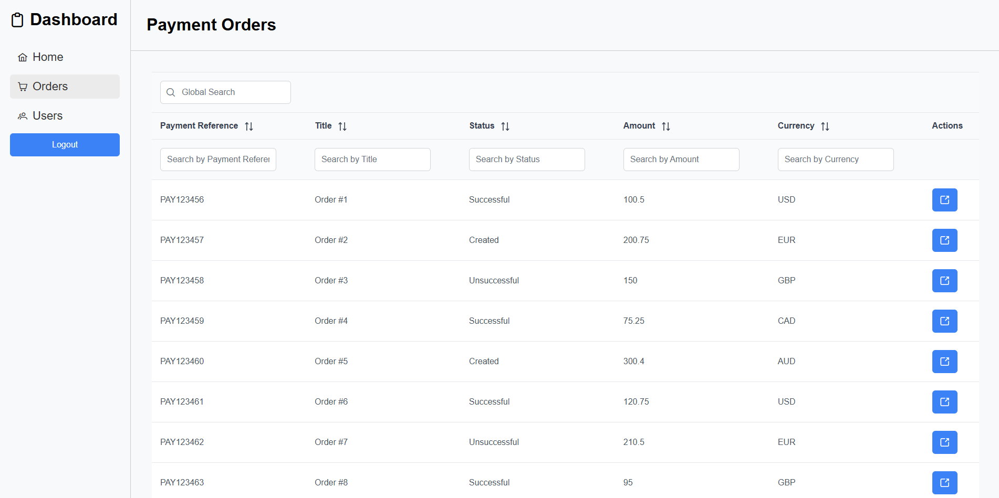

# Admin Dashboard

A modern, responsive admin dashboard built with Angular for managing users and payment orders. This application provides a comprehensive interface for administrators to view analytics, manage user accounts, and track payment transactions.



## 🌟 Features

- **User Management**: Create, view, edit, and delete user accounts with role-based access control
- **Payment Order Management**: Monitor and manage payment transactions with detailed order information
- **Analytics Dashboard**: Visual statistics and charts showing key metrics
- **Role-Based Authentication**: Separate access levels for Administrators and Customers
- **Responsive Design**: Modern UI built with PrimeNG components
- **Real-time Data**: JSON Server backend for seamless data operations

## 🛠️ Built With

- **Angular 18** - Frontend framework
- **TypeScript** - Programming language
- **PrimeNG 17** - UI component library
- **PrimeIcons** - Icon library
- **Chart.js** - Data visualization
- **JSON Server** - Mock REST API backend
- **RxJS** - Reactive programming

## 📁 Project Structure

```
src/
├── app/
│   ├── components/           # Reusable components
│   │   ├── sidebar/         # Navigation sidebar
│   │   └── statistics/      # Dashboard statistics
│   ├── guards/              # Route guards
│   │   ├── auth.guard.ts    # Authentication guard
│   │   ├── login.guard.ts   # Login redirect guard
│   │   └── role.guard.ts    # Role-based access guard
│   ├── pages/               # Page components
│   │   ├── errors/          # Error pages (404, 403, 401)
│   │   ├── home/            # Dashboard home
│   │   ├── login/           # Authentication page
│   │   ├── payment-orders/  # Payment orders list
│   │   ├── payment-order-details/ # Payment order details
│   │   └── users/           # User management
│   ├── services/            # Business logic services
│   │   ├── auth.service.ts     # Authentication service
│   │   ├── payment-order.service.ts # Payment order operations
│   │   └── user.service.ts     # User management operations
│   ├── app.component.*      # Root component
│   ├── app.config.ts        # App configuration
│   ├── app.routes.ts        # Routing configuration
│   └── token.interceptor.ts # HTTP token interceptor
├── index.html               # Main HTML file
├── main.ts                 # Application entry point
└── styles.css              # Global styles
```

## 📊 Data Structure

The application manages two main entities:

- **Users**: Customer and Administrator accounts with role-based permissions
- **Payment Orders**: Transaction records with customer data, payment status, and order details

## Prerequisites

Before you can run this application, make sure you have the following installed:

- Node.js (version 22.3.0)
- npm (version 10.8.1)
- Angular CLI (version 18.0.6)

## Installation

1. **Clone the repository**:

```sh
git clone https://github.com/marinactonci/AdminDashboard.git
cd AdminDashboard
```

2. **Install dependencies**:

```sh
npm install
```

3. **Install JSON Server** (if not already installed globally):

```sh
npm install -g json-server
```

## Running the Application

1. **Start JSON Server**:

JSON Server will serve as our mock backend. Make sure to run it from the project directory where `db.json` is located.

```sh
json-server --watch db.json
```

By default, JSON Server runs on port 3000. Ensure it is running before starting the Angular application.

2. **Start the Angular Application**:

Open another terminal window in the project directory and run:

```sh
ng serve
```

This will start the Angular development server. By default, the application will be accessible at `http://localhost:4200`.

3. **Access the Application**:

Open your web browser and navigate to:

```sh
http://localhost:4200
```

## Usage

**Login**:

- Use any user credentials present in `db.json` under the `users` array.
- The credential for admin user is:

```json
{
  "email": "admin@mail.com",
  "password": "admin"
}
```
